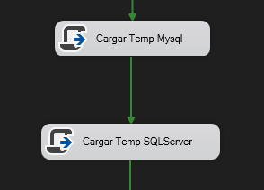
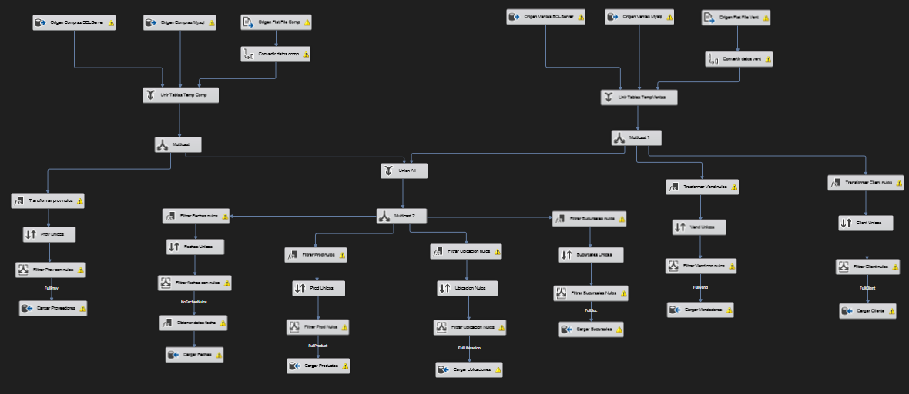
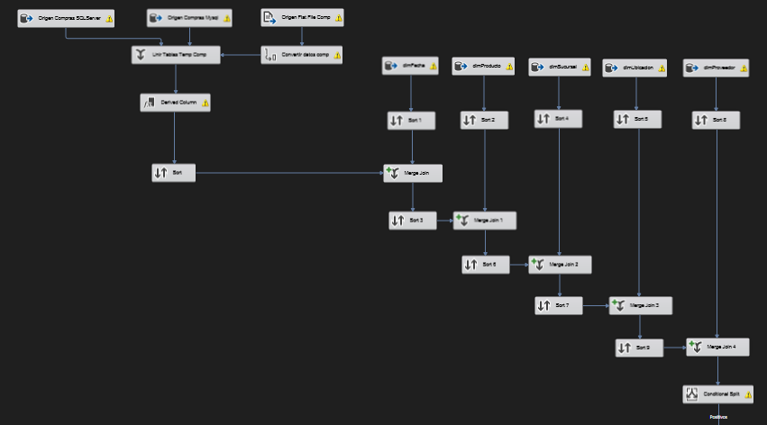
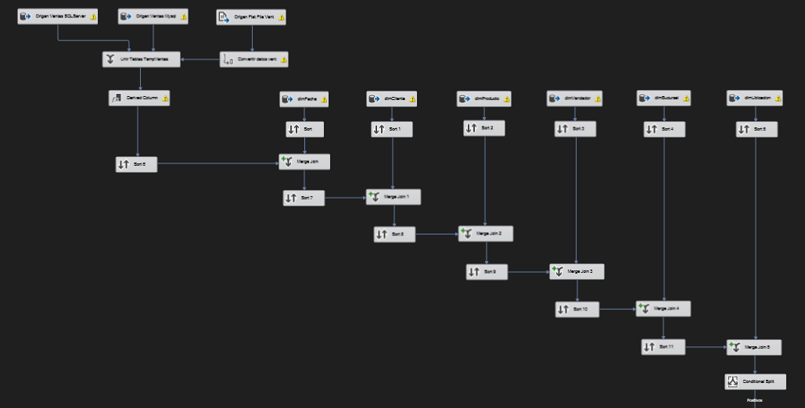

# Proyecto: SGFoodETLTool
*Autor: Esuardo Gabriel Son Mux*

## Data Warehouse
### Modelo de Datos

### Dimensiones
* DimProducto

En esta tabla se almacena toda la informacion de los productos que contienen las diferentes fuentes de datos utilizadas para el ETL.

| Campo | Tipo | Descripción |
| --- | --- | --- |
| idProducto | int | Identificador del producto |
| codProd | varchar(10) | Codigo del producto |
| nombreProd | varchar(100) | Nombre del producto |
| marcaProd | varchar(50) | Marca del producto |
| categoriaProd | varchar(20) | Categoria del producto |

* DimFeha

En esta tabla se almacenan todas las fechas que se encuentran en las diferentes fuentes de datos utilizadas para el ETL.

| Campo | Tipo | Descripción |
| --- | --- | --- |
| idFecha | int | Identificador de la fecha |
| anio | int | Año de la fecha |
| mes | int | Mes de la fecha |
| dia | int | Dia de la fecha |

* DimSucursal

En esta tabla se almacena toda la informacion de las sucursales que contienen las diferentes fuentes de datos utilizadas para el ETL.

| Campo | Tipo | Descripción |
| --- | --- | --- |
| idSucursal | int | Identificador de la sucursal |
| codSucursal | varchar(10) | Codigo de la sucursal |
| nombreSucursal | varchar(100) | Nombre de la sucursal |
| dirSucursal | varchar(150) | Direccion de la sucursal |

* DimCliente

En esta tabla se almacena toda la informacion de los clientes que contienen las diferentes fuentes de datos utilizadas para el ETL.

| Campo | Tipo | Descripción |
| --- | --- | --- |
| idCliente | int | Identificador del cliente |
| codClient | varchar(10) | Codigo del cliente |
| nombreClient | varchar(100) | Nombre del cliente |
| tipoClient | varchar(15) | Tipo de cliente |
| dirClient | varchar(170) | Direccion del cliente |
| numeroClient | int | Numero de telefono del cliente |

* DimProveedor

En esta tabla se almacena toda la informacion de los proveedores que contienen las diferentes fuentes de datos utilizadas para el ETL.

| Campo | Tipo | Descripción |
| --- | --- | --- |
| idProveedor | int | Identificador del proveedor |
| codProv | varchar(10) | Codigo del proveedor |
| nombreProv | varchar(100) | Nombre del proveedor |
| dirProv | varchar(170) | Direccion del proveedor |
| numeroProv | int | Numero de telefono del proveedor |
| webProv | varchar(2) | Pagina web del proveedor |

* DimVendedor

En esta tabla se almacena toda la informacion de los vendedores que contienen las diferentes fuentes de datos utilizadas para el ETL.

| Campo | Tipo | Descripción |
| --- | --- | --- |
| idVendedor | int | Identificador del vendedor |
| codVendedor | varchar(10) | Codigo del vendedor |
| nombreVendedor | varchar(100) | Nombre del vendedor |
| vacionista | varchar(5) | Indica si el vendedor esta vacacionista |

* DimUbicacion

En esta tabla se almacena toda la informacion de las ubicaciones que contienen las diferentes fuentes de datos utilizadas para el ETL. Si bien esto forma parte de la dimension de sucursal, se considera que es una dimension aparte para reducir la redundancia de datos.

| Campo | Tipo | Descripción |
| --- | --- | --- |
| idUbicacion | int | Identificador de la ubicacion |
| region | varchar(150) | Region de la ubicacion |
| departamento | varchar(70) | Departamento de la ubicacion |

### Hechos
* FactVenta

En esta tabla se almacena toda la informacion de las ventas que contienen las diferentes fuentes de datos utilizadas para el ETL.

| Campo | Tipo | Descripción |
| --- | --- | --- |
| idVenta | int | Identificador de la venta |
| idFecha | int | Llave subrogada de la fecha |
| idCliente | int | Llave subrogada del cliente |
| idVendedor | int | Llave subrogada del vendedor |
| idProducto | int | Llave subrogada del producto |
| idSucursal | int | Llave subrogada de la sucursal |
| idUbicacion | int | Llave subrogada de la ubicacion |
| cantUnidades | float | Cantidad de unidades vendidas |
| costoUnidad | float | Precio por unidad |

* FactCompra

En esta tabla se almacena toda la informacion de las compras que contienen las diferentes fuentes de datos utilizadas para el ETL.

| Campo | Tipo | Descripción |
| --- | --- | --- |
| idCompra | int | Identificador de la compra |
| idFecha | int | Llave subrogada de la fecha |
| idProducto | int | Llave subrogada del producto |
| idProveedor | int | Llave subrogada del proveedor |
| idSucursal | int | Llave subrogada de la sucursal |
| idUbicacion | int | Llave subrogada de la ubicacion |
| cantUnidades | float | Cantidad de unidades compradas |
| costoUnidad | float | Precio por unidad |

### ETL
**Extracción**

Para la extraccion de se utilizaron los componentes:
* `tarea Script` para poder conectar a las diferentes fuentes de datos y obtener la informacion necesaria para el ETL.
* `ADO NET Source` para obtener la informacion de la base de datos.

* `Flat file source` para obtener la informacion de los archivos planos.

**Transformación**

Para la transformacion de los datos se utilizaron los componentes: 
* `Union All` para unir la informacion de todos los origenes.
* `Multicast` para poder enviar la informacion a diferentes destinos.
* `Derived Column` para poder realizar operaciones con los datos, creando columnas condiferentes tipos de datos y cambiando datos vacios a nulos.
* `Condition Split` para poder separar la informacion en diferentes flujos de datos.
* `Sort` para poder ordenar la informacion y eliminar valores repetidos.
* `Merge Join` para poder unir la informacion de diferentes flujos de datos realizando correlaciones.

*Transformacion de Datos para Tablas de Dimensiones*

*Transformacion de Datos para Hecho Compras*

*Transformacion de Datos para Hecho Ventas*

**Carga**

Para la carga de los datos se utilizaron los componentes `ADO NET Destination` para poder cargar la informacion a la base de datos.

